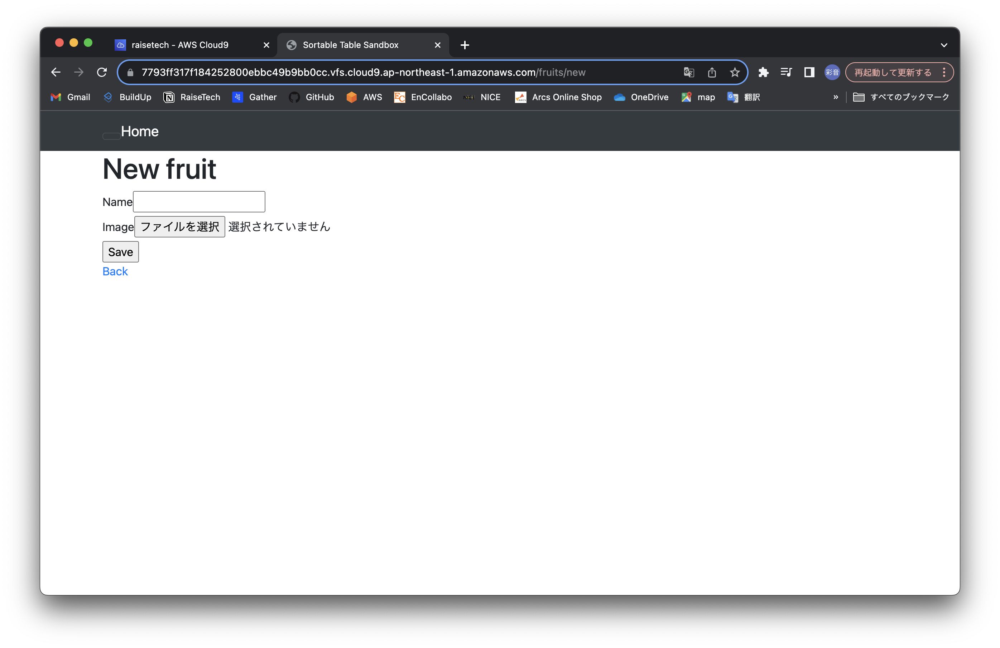
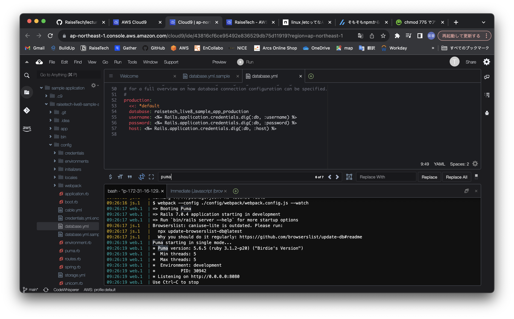
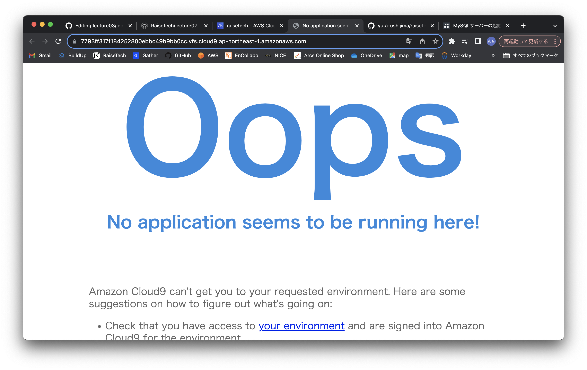
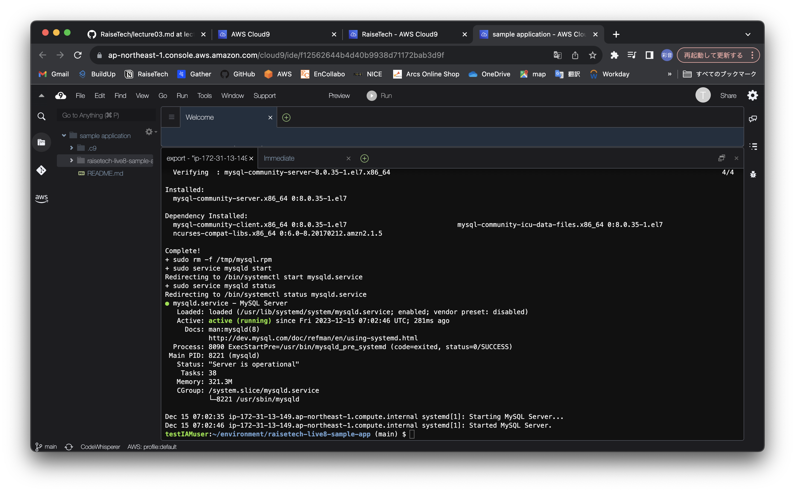
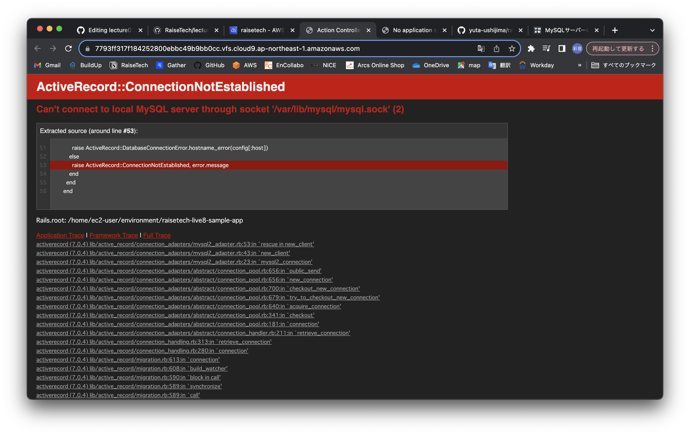
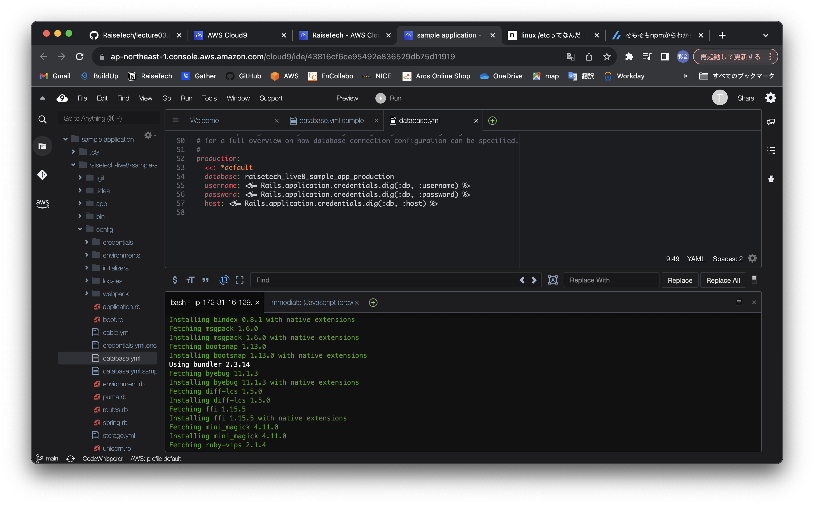

#  第3回課題

##  アプリケーションの起動確認
1. APの起動確認  
  
2. APサーバーの名　Puma バージョン　5.6.5  
>アプリ起動中に確認  

3. APサーバー終了時の挙動  

4. DBサーバー名　MySQL　バージョン　8.0.35  
>MySQL　サインイン時に確認  

5. DBサーバー終了時の挙動  

6. Railsの構成管理ツール名 bundler 2.3.14  
>bin/setup　実行時に確認  

## 学んだ事
- APとDBでそれぞれサーバーがあって、両方が稼働していないとアプリケーションは動かない事が分かった。
- アプリケーションを動かすにあたり、色んな言語(?)を扱うし、各々のバージョンを揃える必要があるので大変。でもちゃんとエラーで示してくれるので賢い。
- エラーが出る原因について調べたら、どういった対処ができるのか判断するためにはそれぞれのコンテンツ(?)を動かすにあたりどういう要素が必要なのかを把握しておく必要がある。今は親切な人のまとめサイトに頼りっきりだけど、いつかは自分の頭の中で原因の候補を出せるようになりたい。
